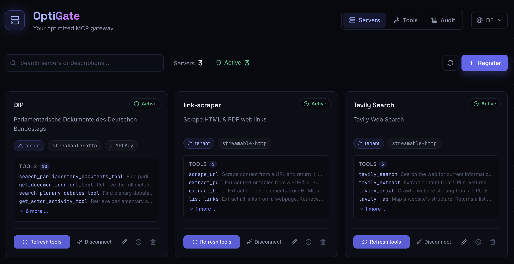

# OptiGate

[](LICENSE)
[](https://www.typescriptlang.org/)
[](https://nodejs.org/)
[](https://vitest.dev/)
[](server/tests)
[](https://glama.ai/mcp/servers/NinjaEde/optigate)
[](https://buymeacoffee.com/ninjaede)

**Your optimized MCP gateway.** One endpoint for all your MCP servers — with
token-sparing tool retrieval built in.

OptiGate is an MCP server registry and gateway. It manages your MCP servers
(registration, health, approval workflow, audit, per‑tenant credential
isolation) and exposes them to any MCP client through a single Streamable
HTTP endpoint. Instead of loading hundreds of tool schemas into the LLM
context, clients query two meta‑tools and retrieve only the tools they
actually need.

```
MCP Client ──▶ POST /mcp ──▶ OptiGate ──▶ managed MCP servers (HTTP/SSE/stdio)
                search_tools + execute_tool only
```

## Why

- **Token explosion** — dozens of MCP servers with hundreds of tools don't fit
  into a context window. OptiGate's retrieval returns the top‑k relevant tools
  per query (~200–800 tokens regardless of registry size).
- **No governance** — who may register which server? Which tool was called
  when, by whom, with what arguments? OptiGate ships roles, approval workflow,
  full audit log, and per‑tenant credential isolation.
- **N+1 client configuration** — without a gateway, every client needs every
  server registered individually. With OptiGate, one entry covers them all.

## Features

| | |
|---|---|
| **Token‑sparing retrieval** | `search_tools(query, k)` returns the k most relevant tool cards across all managed servers |
| **MCP facade** | The registry itself is an MCP server: `search_tools` + `execute_tool` over stateless JSON‑RPC at `/mcp` |
| **Multi‑transport** | Manages `streamable_http`, `sse`, and `stdio` servers |
| **Governance** | Scopes (`global` / `tenant` / `private`), approval workflow, disable/enable, full audit trail |
| **Auth** | Keycloak JWT (RS256/JWKS) in production, dev mode for local testing |
| **Self‑updating index** | Auto‑connects healthy servers on boot (3 retries each), keeps the tool index fresh on a loop with jitter |
| **Per‑tenant credential bindings** | Shared servers connect with each tenant's own credentials; bindings persisted in Postgres |
| **Args validation** | Tool arguments are validated against `inputSchema` before forwarding (required fields + type checks) |
| **SSRF protection** | URL allowlist via `SSRF_ALLOWED_HOSTS` env; built‑in deny of loopback/link‑local addresses |
| **Rate limiting** | 200 req/min global via `@fastify/rate‑limit` |
| **Admin UI** | Server cards with status badges, custom key/value headers, live tool search view, audit feed — DE/EN/FR |

## Admin UI


## Quick Start (Docker Compose)

The fastest way to run OptiGate is the bundled Compose stack — no local Node
or Postgres required:

```bash
# Copy the example env and adjust
cp .env.example .env

# Development stack: Postgres + API (hot reload via tsx watch) + Web UI (Vite HMR)
docker compose -f docker-compose.dev.yml up

# UI   → http://localhost:3030
# API  → http://localhost:8100/health
# MCP  → http://localhost:8100/mcp
```

For production:

```bash
# Set these in your environment or .env:
#   AUTH_MODE=keycloak   KEYCLOAK_URL=...   KEYCLOAK_REALM=...
#   SECRET_ENCRYPTION_KEY=...   POSTGRES_PASSWORD=...
docker compose up --build -d

# UI  : http://localhost:8080  (nginx, /api proxied to the server)
# API : http://localhost:8100  (Keycloak JWT required)
```

Data lives in the `pgdata` volume; the schema is created idempotently on boot.

### Run without Docker

Both services are plain Node projects:

```bash
cd server && npm i && AUTH_MODE=dev npm run dev    # API on :8100
cd web    && npm i && npm run dev                  # UI on :5173 (proxies /api)
```

Without `DATABASE_URL` the server runs on an **in‑memory repository** — handy
for trying it out, but data is lost on restart.

## Connecting MCP clients

Register OptiGate once in any MCP client:

```json
{
  "mcpServers": {
    "optigate": {
      "type": "http",
      "url": "http://localhost:8100/mcp",
      "headers": { "x-dev-user": "alice" }
    }
  }
}
```

That's it — `search_tools` and `execute_tool` now give the client access to
every visible registry server.

## How the token saving works

1. `search_tools("chart", k=5)` → lexically scored tool cards (name,
   description, input schema) across all indexed servers.
2. `execute_tool(server_id, tool_name, args)` → routed through the connection
   pool; only `healthy/degraded` servers, scope‑checked for the caller, args
   validated against the cached schema.

Context cost stays constant no matter whether you manage 20 or 2,000 tools.
The web UI has a **Tool Search** view that runs the exact same retrieval path,
so you can inspect what agents would see.

## Multi‑tenancy & user separation

Every request carries an authenticated identity (`AuthContext`) consisting of
`userId`, `role`, and `tenantId`. This identity drives three policy checks:

**1. Scope visibility (`canView`) — what may this user see?**

| Server scope | Who sees it |
|---|---|
| `global` | everyone |
| `tenant` | users whose `tenantId` matches the server's tenant |
| `private` | only the user who registered it (`ownerId === userId`) |

All list/search/execute endpoints filter through this rule, so tenants cannot
see each others' servers and private servers stay invisible to everyone else.

**2. Registration rights (`canRegister`) — who may register what?**

`global` scope requires `superadmin`; `tenant` and `private` require at least
`admin`. The registering user's tenant/user id is stored on the server record
and later used for visibility and ownership checks.

**3. Approvals (`canApprove`) — supply‑chain gate**

New servers start as `pending_approval` when `APPROVAL_REQUIRED=true`; only
`superadmin`s can approve them into `healthy` state (or re‑enable disabled
ones). Unapproved servers never appear in any index or search result.

**4. Credential bindings — shared servers, per‑tenant credentials**

Shared HTTP/SSE servers are visible platform‑wide, but each tenant can
bind its own credentials via the bindings API (`PUT
/api/servers/:id/bindings/:tenantId`). The connection pool resolves the
caller's tenant scope and injects the correct auth headers on every request.
Bindings are persisted in Postgres (`server_credential_bindings` table).

In production the identity comes from a Keycloak JWT: `userId` from the
`sub` claim, roles from `realm_access`/`resource_access`, and `tenantId` from
the first `organization` claim.

## Dev authentication (`AUTH_MODE=dev`) and its headers

Dev mode skips token verification and derives the identity from optional
request headers — so you can test multi‑user behavior locally without an IdP:

| Header | Default | Meaning |
|---|---|---|
| `x-dev-user` | `dev-user` | Sets the `userId` (owner of `private` servers, audit actor) |
| `x-dev-role` | `superadmin` | One of `superadmin` / `admin` / `user` — controls registration and approval rights |
| `x-dev-tenant` | `dev-tenant` | Sets the `tenantId` — controls visibility of `tenant`-scoped servers |

Example — simulate a plain user of another tenant:

```bash
curl -H "x-dev-user: bob" -H "x-dev-role: user" -H "x-dev-tenant: other" \
  http://localhost:8100/api/servers
```

Without these headers every dev request acts as the default superadmin in
`dev-tenant`.

> **Warning:** dev headers grant full identity control by design. Never run
> `AUTH_MODE=dev` on a network‑exposed instance; use Keycloak mode instead.

## Configuration

| Variable | Default | Purpose |
|---|---|---|
| `AUTH_MODE` | `keycloak` | `dev` = header‑based identity, no token required |
| `DATABASE_URL` | – | Postgres connection; unset = in‑memory repository |
| `APPROVAL_REQUIRED` | `true` | New servers start as `pending_approval` |
| `PORT` | `8100` | API listen port |
| `SECRET_ENCRYPTION_KEY` | – | AES‑256‑GCM key for direct secret entry (min 32 chars) |
| `KEYCLOAK_URL` | – | Keycloak issuer URL |
| `KEYCLOAK_REALM` | – | Keycloak realm name |
| `KEYCLOAK_AUDIENCE` | realm value | Expected JWT audience |
| `SSRF_ALLOWED_HOSTS` | – | Comma‑separated allowed hosts/globs for outgoing MCP connections; unset blocks only loopback/link‑local |
| `CORS_ORIGIN` | all origins | Comma‑separated allowed CORS origins for the API |
| `MAX_CONNS_PER_SERVER` | `20` | Max simultaneous connections per upstream MCP server |

## Security features

| Measure | What it does |
|---|---|
| **SSRF protection** | `SSRF_ALLOWED_HOSTS` env blocks unlisted hosts; deny‑list for 169.254.169.254, loopback, link‑local |
| **Args validation** | Required fields and types checked against `inputSchema` before forwarding |
| **Rate limiting** | 200 req/min global via `@fastify/rate‑limit` |
| **Audit scope** | `GET /api/audit` filters by caller's tenant (superadmin sees all) |
| **IDOR protection** | Tool listings, server details & bindings checked against `canView` policy |
| **Secrets at rest** | AES‑256‑GCM (`SECRET_ENCRYPTION_KEY`); plaintext never in DB or responses |
| **Dev‑mode guard** | `AUTH_MODE=dev` only; Keycloak mode requires valid RS256 JWT |

## Development

```bash
cd server && npm test          # vitest (92+ tests)
cd server && npm run lint      # eslint
cd server && npm run typecheck # tsc --noEmit
cd server && npm run build     # tsc → dist/
cd web    && npm run build     # vite build
```

## Stack

Node.js 24 · Fastify · TypeScript · official MCP SDK · Postgres 17 ·
React 18 · Vite · Tailwind CSS v4

## License

MIT — free to use, modify, and distribute.

If this project saves you time or helps your agents work better, you can
support it here:

[☕ Buy me a coffee](https://buymeacoffee.com/ninjaede)